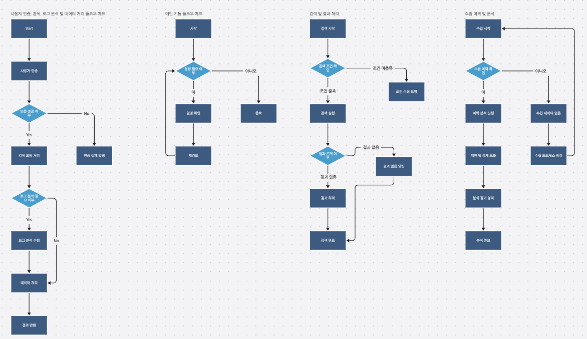
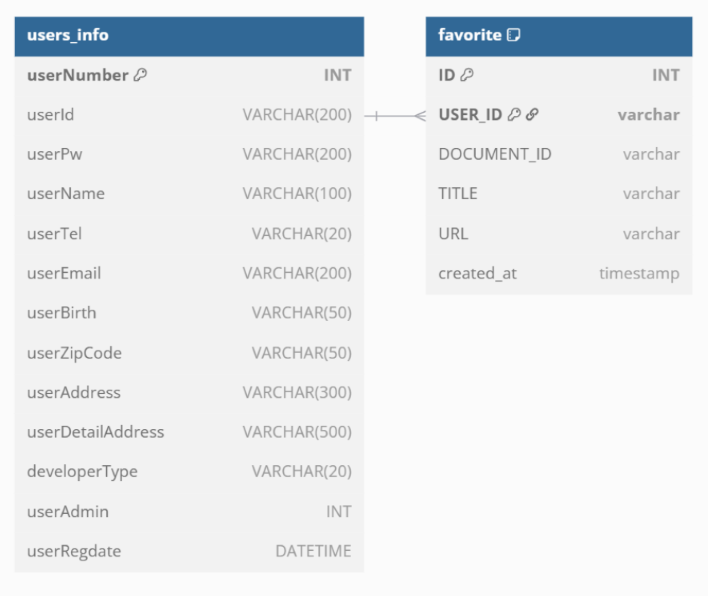
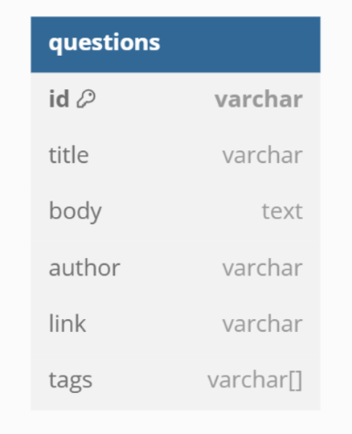
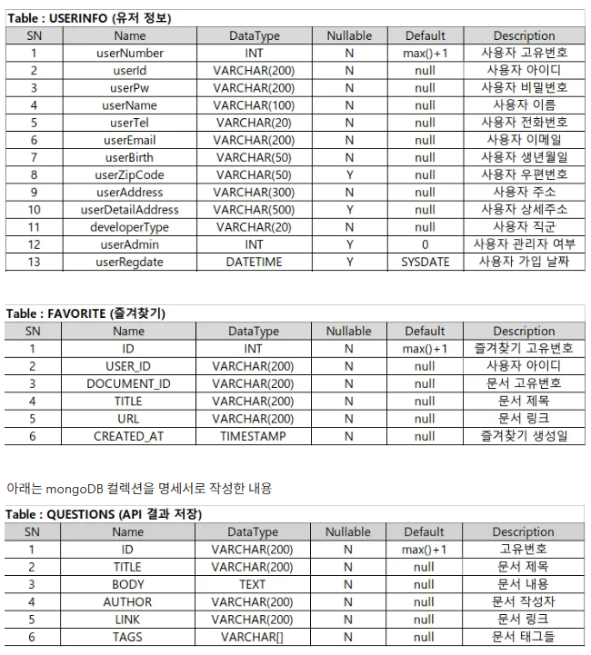

# 🚀 ElasticSearch_pj5

> **기술 키워드 기반 오픈 데이터 검색 & 트렌드 분석 플랫폼**  
> MongoDB ↔ Monstache ↔ Elasticsearch 연동을 통해 **형태소 분석 기반 검색 시스템**을 구축했습니다.  
> JWT 인증, Swagger 문서화, CSV/Excel 다운로드 및 변환환 등 실무 기술을 적용했습니다.
> Elasticsearch(인덱스,문서 관리, 검색, 집계API)

---

## 📌 프로젝트 개요

- **진행 기간**: 2025.05.27 ~ 2025.06.17  
- **인원 구성**: 4인 팀 프로젝트  
- **기술 스택**:  
  - **Backend**: Spring Boot, MyBatis, JWT  
  - **Frontend**: React, Tailwind CSS  
  - **Infra**: Docker, MongoDB, Monstache, Elasticsearch  
  - **기타**: Swagger, GitHub Actions, Render

---

## 🧩 주요 기능

| 기능 | 설명 |
|------|------|
| 🔐 JWT 인증 | 사용자 로그인/인가 토큰 처리 |
| 🔄 Monstache 연동 | MongoDB → Elasticsearch 실시간 데이터 동기화 |
| 🔍 형태소 검색 | Elasticsearch + Nori 분석기로 자연어 검색 |
| 📊 Swagger | API 명세 및 테스트 제공 |
| ⬇️ CSV/Excel 다운로드 | API 응답 데이터 다운로드 기능 |

---

📁 프로젝트 구조 및 설계

### 📌 업무 흐름도

### 🗂️ ERD

### 💻 화면 설계
- 검색창 + 필터
- 형태소 분석 결과 리스트
- 로그인/회원가입

### 📝 테이블 명세 

---

📷 시연 영상 및 발표 요약

### 🎥 시연 영상  
📺 [👉 유튜브로 시연 영상 보러가기](https://youtu.be/QaNWE73Mm_g?si=qnytRfteBIAMXFIs)

### 🧾 발표 요약

로그인 수집이력 그래프 검색후

로그인회원가입 비밀번호찾기 소셜로그인

버튼(api문서, 즐겨찾기, 사이트방문)

Stackoverflow top 10 지표화

수집이력페이지 즐겨찾기

ubuntu 서버 배포
- 프론트엔드: Ubuntu 서버에 배포 완료
- 백엔드: 추후 연동 예정 (작업 중)

#### 📌 중간 발표 (2025.06.10)
- 실시간 검색의 필요성과 기술 구성 소개
- Docker 기반 연동 흐름 설명
- 형태소 검색 결과 시연

#### 🗓️ 주간 보고서
- 1주차: 기획, 기술 조사, 초기 세팅  
- 2주차: 기능 구현, API 연동, 테스트  
- 3주차: 기능구현, 테스트, 배포, 문서화, 발표 준비

---

📦 릴리즈 내역

### 🔖 [중간점검 릴리즈 (2025.06.10)](https://github.com/yuriuser126/ElasticSearch_pj5/releases/tag/v1.0-mid)

- 발표자료(PDF) 업로드  
- 주간보고서 2종 포함  
- 발표 대본 및 산출물 압축 파일 포함  
- 기능 목록 및 기술 스택 요약

### 🔖 [최종 발표 릴리즈 (2025.06.17)](https://github.com/yuriuser126/ElasticSearch_pj5/releases/tag/v1.0-final)

- 발표 자료(PDF, PPTX, ZIP) 업로드  
- 발표 대본(txt) 및 주간 보고서 이미지 포함  
- 발표 자료 전용 압축본 포함 (`ElastiQuery.zip`)  
- 기술 문서 및 API 문서 경로 안내 (`/docs` 폴더 참고)

---

📘 Confluence Collaboration

> 모든 팀원이 각자 맡은 역할에 따라 문서를 작성하고 실시간 피드백을 주고받으며 협업하였습니다.
> 아래는 팀원별 Confluence 문서 링크입니다. (PDF 내보내기 버전은 `/docs` 폴더에 포함)

- 👤 성유리 (PM) – [기획 및 일정 관리,프론트엔드 UI/UX 흐름 설계,Elastic](./docs/confluence-yuri.pdf) 
- 👤 정재윤 – [백엔드 API 설계 및 동기화 구조,Elasticsearch 검색 및 형태소 분석 정리](./docs/confluence-jaeyoon.pdf)  
- 👤 김채윤 – [리액트 및 jwt로그인, 서버구축](./docs/confluence-chaeyoon.pdf)   
- 👤 손병관 – [swagger 자동문서화, Tableau Public 시각화](./docs/confluence-byungkwan.pdf)  

---

🌿 브랜치 전략 및 개발 규칙

### 🔧 git flow 브랜치 전략

| 브랜치 | 역할 |
|--------|------|
| 🟢 `main` | 배포 전용, 직접 커밋 ❌ |
| 🟡 `develop` | 통합 개발 브랜치 |
| 🔵 `feature/*` | 기능별 개인 작업 브랜치 |

### 📎 커밋/작업 규칙
- `main` 브랜치로 직접 작업/PR 금지  
- 항상 최신 `develop` 기준으로 작업  
- 민감 정보(.env, 키 등) 절대 커밋 금지  
- 작업 중 `develop` 최신 pull → 충돌 최소화

### 💻 Sourcetree 기준 브랜치 체크아웃
1. Sourcetree 실행 후 저장소 열기  
2. 상단 **Fetch** 클릭 → 원격 브랜치 갱신  
3. **origin/브랜치명** 우클릭 → **Checkout**

---

📝 프로젝트 개인별 (GitHub 링크)

- 👤 [성유리(PM)](https://github.com/memberA) 
- 👤 [정재윤](https://github.com/tjrdl?tab=repositories) 
- 👤 [김채윤]( https://github.com/tjrdl?tab=repositories) 
- 👤 [손병관]( https://github.com/tjrdl?tab=repositories) 

---

📁 첨부 자료 및 원문서

- 업무 분장표  
- 기술 명세서  
- 📋 [테이블 명세서](./docs/Table Schema.png)
- 발표 자료(PPT)
- 📄 [프로그램 기술서 보러가기](./docs/tech-doc.md)
- `/docs` 폴더 내 포함됨

